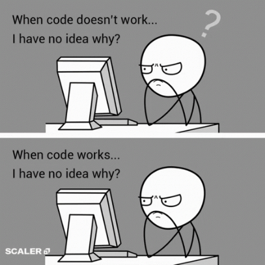

<h1><b>Hi there, I'm </b><a href="https://github.com/saad-jebbour">Saad Jebbour</a> </h1>
 

  

&nbsp;***About me***

 
 

🎓 Computer Science student at **National School of Applied Sciences, Agadir**  
📚 Specializing in **Software Engineering**  
🚀 Currently a beginner, exploring new projects  
🎯 Open to collaboration & learning  

- 🌱 I’m currently learning:  
  - *C++*  
  - *JavaScript*  
  - *SQL*  
- ✔ Feel free to ask me anything about **programming basics, debugging, and web development**.  
- 🎮 Outside tech, I enjoy playing video games, 🎵 listening to music, and spending time with friends.  
- 📫 Reach me at: <a href="mailto:saad.jebbour25@gmail.com">saad.jebbour25@gmail.com</a>  
 

<!-- Social Links -->

  
  
  
  

 

&nbsp; ***Skills***

###### Languages & Syntax:
&nbsp;
&nbsp;
&nbsp;

###### Frontend Development:
&nbsp;
&nbsp;

###### Database Management:
&nbsp;

###### Development Tools:
&nbsp;
&nbsp;
&nbsp;

---

&nbsp; ***My Projects***

  <table>
    <tr>
      <td width="50%">
        <h3 align="center">Mini Weather Station</h3>
        

          
          

            
          

          
<strong>Mini Weather Station</strong> built in <strong>C++</strong> using the <strong>Observer Design Pattern</strong> with different display modes.The system simulates a weather monitoring station that collects atmospheric data and automatically updates multiple display interfaces whenever weather conditions change.

        

      </td>
    </tr>
  </table>

 

 

<!-- Github Stats -->
&nbsp;***Github Stats***

 

<table align="center">
<tr>
<td width="50%" align="center">
    
</td>
<td>
  <!-- Most Used Languages -->
<h3 align="center">Most Used Languages</h3>

  
  
  
  
  
  

</td>
</tr>
</table>

 

<!-- GitHub Trophies -->

  

 

## 🎯 Current Focus

- 🌱 Learning **Java** & **Object-Oriented Programming**
- 🚀 Improving my skills in **C++** & **Design Patterns**
- 🌐 Building small web projects with **HTML**, **CSS**, and **JavaScript**
- ⚙️ Working with **databases (SQL)** and system concepts
- 🚀 Preparing for coding challenges & problem-solving

<!-- Visitor Counter -->
 

  

 
 

